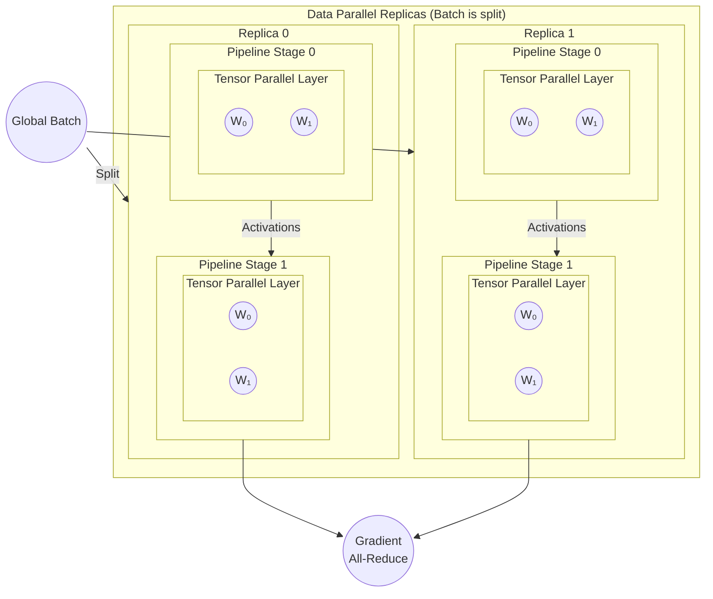

# Model Parallelism: 3D Parallelism

In 2026, **3D Parallelism** is the industry standard for training "Gigantic" models (models with 1 trillion to 100 trillion parameters). 
It is not a new type of parallelism, but rather a **coordinated orchestration** of the three techniques: **Data, Pipeline, and Tensor Parallelism**.

Think of it as a 3D grid (a "device mesh") where each GPU has an $(x, y, z)$ coordinate representing its role in the cluster.

## 1. The Three Dimensions
To train a model like GPT-5, you need to solve three problems at once:
1.  **Too much data** to process on one machine.
2.  **Too many layers** to fit in one GPU's memory.
3.  **Layers too wide** to fit in one GPU's memory.

3D Parallelism solves these by assigning every GPU to three different "groups" simultaneously:

| Dimension | Technique | Primary Goal | Communication Speed Needed |
| :--- | :--- | :--- | :--- |
| **X-Axis** | **Tensor Parallelism** | Slicing wide layers | **Ultra-Fast** (NVLink) |
| **Y-Axis** | **Pipeline Parallelism** | Stacking tall layers | **Fast** (InfiniBand/Dedicated) |
| **Z-Axis** | **Data Parallelism** | Processing massive data | **Medium** (Standard Cluster Net) |

## 2. How the "Mesh" Works
Imagine a cluster of **32 GPUs**. You might organize them into a $2 \times 4 \times 4$ mesh:
* **Tensor Parallel Size (TP=2):** GPUs are paired up to split individual matrix multiplications.
* **Pipeline Parallel Size (PP=4):** The model is split into 4 chunks of layers.
* **Data Parallel Size (DP=4):** There are 4 complete "replicas" of the entire pipeline.

Each GPU now has a specific job. GPU (0,0,0) handles the first half of the first layer-block for the first data replica. 

## 3. The 2026 Advantages
* **Maximum Memory Efficiency:** By sharding the weights (Tensor), the layers (Pipeline), and the optimizer states (via ZeRO/FSDP within the Data dimension), you can fit models that are 1,000x larger than the memory of a single GPU.
* **Optimal Hardware Mapping:**
    * **TP** is kept inside a single server (intra-node). 
    * **PP** happens between adjacent servers (inter-node/intra-rack). 
    * **DP** happens across the entire data center (inter-rack).

## 4. The Challenges: "The Topology Headache"
The biggest challenge in 3D Parallelism is **Balance**. 
* If your Pipeline stages are uneven, one rack sits idle (the bubble). 
* If your Tensor groups are too large, you spend all your time on NVLink overhead.
* If your Data Parallel groups are too large, your global batch size becomes so massive that the model stops learning effectively (divergence).

## Real-World Systems Using 3D Parallelism

* Megatron-LM
* DeepSpeed
* PaLM / GPT-4-class systems
* LLaMA training stacks

---

# 3D Parallelism in Action

## Visual

## Design

**3D Parallelism = Data Parallelism × Tensor Parallelism × Pipeline Parallelism**

`Total GPUs = DP × TP × PP`

The visua above shows how a single training step is executed by:
* Replicating the model (Data Parallelism),
* Splitting each layer (Tensor Parallelism),
* Splitting the model depth (Pipeline Parallelism)

so that very large models can fit in memory and train efficiently across **hundreds or thousands of GPUs**

### Data Parallelism (Outer Level)
  * What you see in the diagram
    * Two large blocks: `Replica 0` and `Replica 1`
    * Both contain the same model structure
  * What’s happening
    * The `global batch` is split into smaller batches.
    * **Each replica processes different data samples**:
      * Replica 0: Batch Slice A
      * Replica 1: Batch Slice B
    * Each replica computes **its own forward and backward pass**.
  * Why it exists
    * Scales training throughput
    * Easy to parallelize
    * Limited by model size per replica
  * Synchronization
    * After backpropagation:
      * Gradients from all replicas are all-reduced
      * Ensures identical model weights across replicas

### Pipeline Parallelism (Vertical Split Inside Each Replica)
  * What you see
    * Each replica is divided into: `Pipeline Stage 0`, `Pipeline Stage 1`
  * What’s happening
    * The model depth (layers) is split across stages:
      * Stage 0 -> Early Layers
      * Stage 1 -> Later Layers
    * Input activations flow stage by stage:
      * Stage 0 → activations → Stage 1
  * Why it exists
    * Allows very deep models to fit in memory
    * Each GPU holds only a subset of layers
  * Efficiency detail
    * Training uses **micro-batches**:
      * While Stage 1 works on micro-batch N,
      * Stage 0 can already process micro-batch N+1
    * This overlaps computation and reduces idle time (pipeline bubbles)

### Tensor Parallelism (Inside Each Pipeline Stage)
  * What you see
    * Inside each pipeline stage:
      * A Tensor Parallel Layer
      * Weight shards like `W₀`, `W₁`
  * What’s happening
    * Individual layers (e.g. Transformer attention or MLP) are split across GPUs
    * Each GPU owns part of a weight matrix:
      * W = [W₀ | W₁]
    * All GPUs:
      * Receive the same input activation
      * Compute partial results in parallel
    * Partial outputs are communicated and combined
  * Why it exists
    * Enables very wide layers
    * Solves the “single layer too big for one GPU” problem

## Process

### How a Single Forward Pass Works

For **one micro-batch**:

**1. Data Parallel**
  * Replica 0 and Replica 1 each get different samples
**2. Pipeline Parallel**
  * Stage 0 computes early layers
  * Sends activations to Stage 1
**3. Tensor Parallel**
  * Inside each stage:
    * GPUs compute partial matrix multiplies
    * Results are merged via collectives
**4. Output**
  * Final activations emerge from last pipeline stage

### Backward Pass & Synchronization

**Backpropagation happens in reverse:**
* Pipeline stages run **backwards**
* Tensor-parallel gradients require **in-layer collectives**
* Data-parallel gradients are **all-reduced across replicas**

**Final result:**
* Every replica ends with **identical updated weights**
* Model stays consistent across thousands of GPUs

This is how **trillion-parameter models** are trained in practice.
