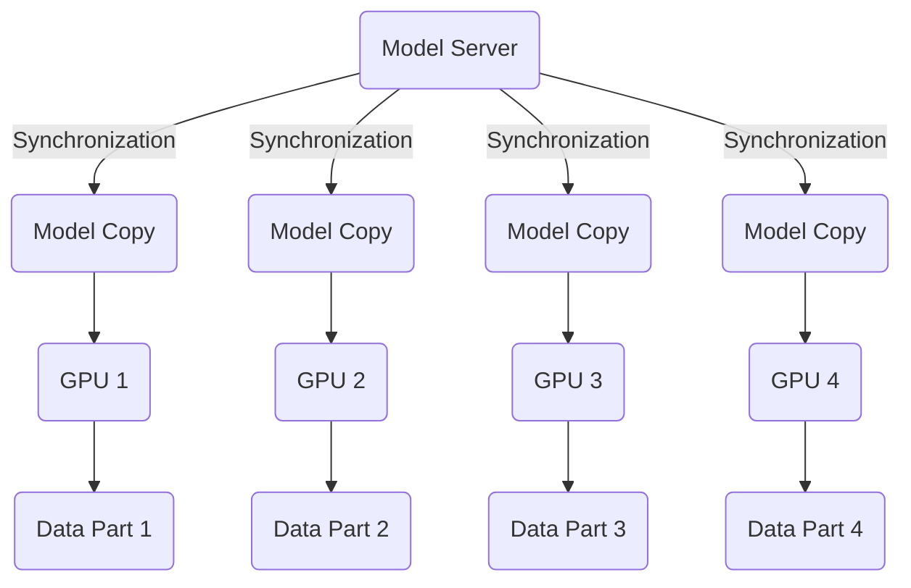

# Distributed Training

Multiple GPUs
* For large models with billions of parameters (subsequently, the memory requirements are huge), we use multiple GPUs train.

**Setting**
* One model
  - one set of weights
* Large dataset
* Multiple GPUs

## How can we parallelize the models over these GPUs?

### Solution 1: Data parallelism (2016-ish)

**Setting**
* One model copy per GPU. One copy resides on Model Server.
* Split data among GPUs
* Synchronize model weights
  - Gradients to server
  - New weights come back
* Optimizer on server

This does not save any memory requirement. We just have different copies of models on different GPUs. However, it allows us to **split the data into different chunks** and then **process data in parallel.**

**Process** 
* Copy model to each GPU
* Split data among GPUs
* We will call 'forward' and 'backward' within each GPU, this will give us a gradient over a batch of data.
* We will send the gradient back to the Model Server. Model Server will wait until it receives the gradients from all the GPUs,
* Model Server does the aggregation and optimizing. Model Server sends back new updated weights and the average of the gradients to the GPUs.
* This allows us to save a little bit of memory.

**Advantages:**
* Close to n x speedup for n<= 8 GPUs
* Simple to implement

**Issues:**
* Synchronization is slow for many GPUs
* Data Transfer 2 x nbr of weights (once from Model Server to GPU, and then back)
* Model still needs to fit on GPU. With Model Server in place for optimizer and optimizers states, we may need half the memory; otherwise we need the entire memory.

**Data parallelism variant (post-2016)** 

Previously, the synchronization used to happen on different machines, nowadays data parallelism happens mostly within a machine. Hence less synchronization required.

### Solution 1.1: Modern Data parallelism

**Setting**
* No Model Server
* One model copy per GPU
* Split data among GPUs
* **Only synchronize gradients**
  - **Each GPU has own optimizer**
  - **all-reduce** to accumulate gradient. Each GPU gets to see gradients of all other GPUs.

The amount of communication increases (all GPUs communicating with each other). However, a (basic low-level) hardware solution resolves this issue.
* Communication link between different GPUs has an operation **"all-reduce"**, which takes values from each of the GPUs, add all the values, and store the results in each GPU. ref: NCCL from NVIDIA libraries.

**Advantages**
* Close to **n x** speedup for n <= 8 GPUs
* Simpler to implement (than a p[revious Model Server-based solution)
* Data transfer **1 x** nbr of weights

**Issues**
* Model needs to fit on GPU. Slightly worse than precviouls Model Server-based solution.
* Some trickiness to synchronization. Hwoever, we can ignore if using PyTorch.

