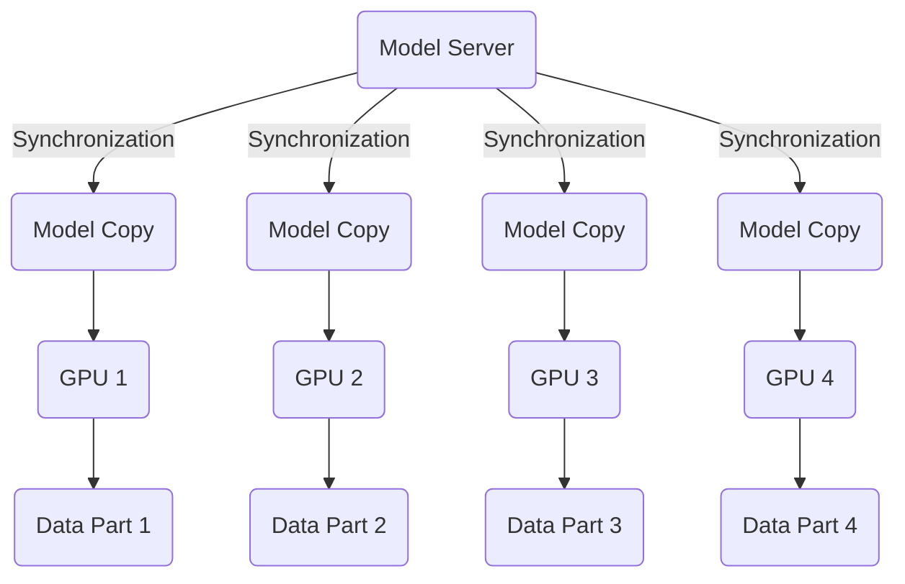
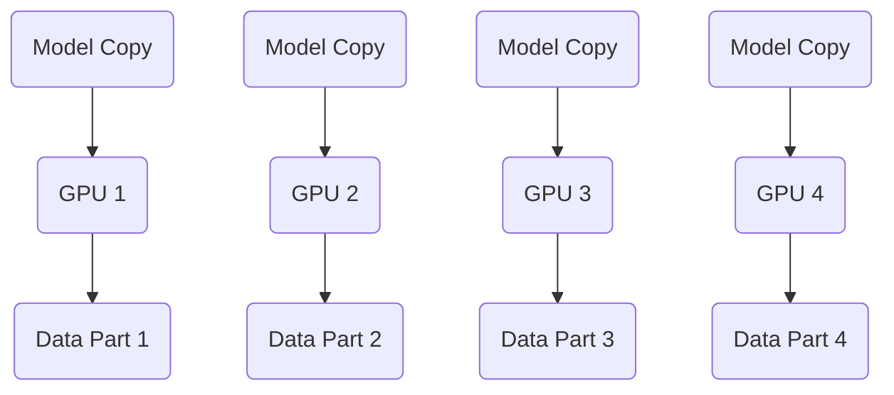
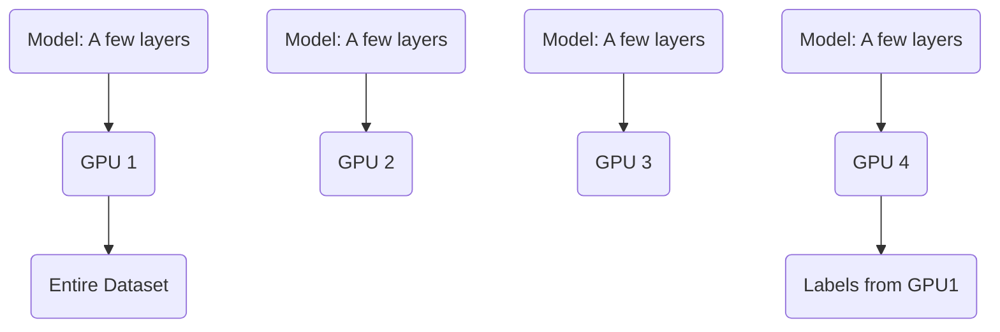

# Distributed Training

In the context of 2026, **Distributed Training** is no longer just an "option" for high-end researchers—it is the **standard operating procedure** for training any modern Large Language Model (LLM) or generative agent. 

It is the process of spreading the computational workload of training a single model across multiple processors (GPUs or TPUs), often spanning hundreds or thousands of interconnected "nodes" (individual servers).

## 1. What Issue Does It Resolve?
Distributed training addresses the **"Scale Ceiling."** As models grow toward tens of trillions of parameters, they encounter two physical barriers that a single machine cannot overcome:

* **The Memory Wall:** A model like GPT-5 might require **terabytes of VRAM** just to hold the weights. Even the most powerful 2026 GPUs (like the **NVIDIA B200 Ultra with 192GB**) cannot fit the whole model, let alone the "activations" and "gradients" generated during training.
* **The Time Wall:** Training a massive model on a single GPU would literally take decades. Distributed training reduces this to **weeks or months**.

For large models with billions of parameters (subsequently, the memory requirements are huge), we use **multiple GPUs** to train. How can we parallelize the models over these GPUs?

**Setting**
* One model
  - one set of weights
* Large dataset
* Multiple GPUs

## 2. The Two Core Strategies
Distributed training generally takes two forms, often used simultaneously:

### Strategy 1: Data Parallelism (DP) (2016-ish)

Each GPU gets a **full copy of the model**, but a **different slice of the data**.
* **The Workflow:** Each GPU calculates how to improve the model based on its specific data slice, then all GPUs "sync up" to average their findings before taking the next step.

**Setting**
* One model copy per GPU. One copy resides on Model Server.
* Split data among GPUs
* Synchronize model weights
  - Gradients to server
  - New weights come back
* Optimizer on server

This does not save any memory requirement. We just have different copies of models on different GPUs. However, it allows us to **split the data into different chunks** and then **process data in parallel.**

**Process** 
* Copy model to each GPU
* Split data among GPUs
* We will call 'forward' and 'backward' within each GPU, this will give us a gradient over a batch of data.
* We will send the gradient back to the Model Server. Model Server will wait until it receives the gradients from all the GPUs,
* Model Server does the aggregation and optimizing. Model Server sends back new updated weights and the average of the gradients to the GPUs.
* This allows us to save a little bit of memory.

**Advantages:**
* Close to n x speedup for n<= 8 GPUs
* Simple to implement

**Issues:**
* Synchronization is slow for many GPUs
* Data Transfer 2 x nbr of weights (once from Model Server to GPU, and then back)
* Model still needs to fit on GPU. With Model Server in place for optimizer and optimizers states, we may need half the memory; otherwise we need the entire memory.

**Data parallelism variant (post-2016)** 

Previously, the synchronization used to happen on different machines, nowadays data parallelism happens mostly within a machine. Hence less synchronization required.

---
### Solution 1.1: Modern Data parallelism

**Setting**
* No Model Server
* One model copy per GPU
* Split data among GPUs
* **Only synchronize gradients**
  - **Each GPU has own optimizer**
  - **all-reduce** to accumulate gradient. Each GPU gets to see gradients of all other GPUs.

The amount of communication increases (all GPUs communicating with each other). However, a (basic low-level) hardware solution resolves this issue.
* Communication link between different GPUs has an operation **"all-reduce"**, which takes values from each of the GPUs, add all the values, and store the results in each GPU. ref: NCCL from NVIDIA libraries.

**Advantages**
* Close to **n x** speedup for n <= 8 GPUs
* Simpler to implement (than a p[revious Model Server-based solution)
* Data transfer **1 x** nbr of weights

**Issues**
* Model needs to fit on GPU. Slightly worse than precviouls Model Server-based solution.
* Some trickiness to synchronization. Hwoever, we can ignore if using PyTorch.

---

### Strategy 2: Model Parallelism (MP)

The **model itself is sliced** like a loaf of bread, and each GPU holds only one piece.
* **Pipeline Parallelism:** Layer 1-10 are on GPU A, Layer 11-20 are on GPU B.
* **Tensor Parallelism:** A single massive matrix multiplication is split across multiple GPUs to work on it at the same time.

**Setting**
* Split model across GPUs
* Option 1: Split along layers - aka `Pipeline Parallelism`
  - Pipeline parallelism
* Option 2: Split each layer i.e. split the tensors, the data - aka `Tensor Parallelism` - not so popular, tricky implementation with > GPUs
  - Tensor parallelism
  - Very complex, no longer used

#### Option 1: Pipeline parallelism
* Each GPU holds a **few consecutive layers** of a network
* **GPU1** hold dataset
* GPUs pass activations on in forward
* GPUs pass gradients on in backward
* We split the model by hand

**Process**
* GPU1 holds the **entire dataset**.
* GPU1 takes it thourgh the first few layers and pass the **activations** to the next GPU.
* Other GPUs do the same, some GPUs may receive activations from other previous layers as well e.g. in the case of skip connections.
* The same play happens in reverse (from GPU4 -> GPU3 -> GPU2- GPU1) for **gradients** in the backward pass.
* GPU4 has to be passed the **labels** from GPU1. 

**Issue**
* Bubbles
  - In its vanilla form of this solution, only one GPU works at a time; the other GPUs sit idle.

**Solution**
* Instead of feeding one batch of data through the GPU, we feed **multiple micro batches** through, i.e. **split batch into parts**.
* Bubbles still exist but is much smaller.

---

### Memory requirements (revisit)**

* **16 N bytes** without counting activations.
* **Data parallelism**
  - Each GPU needs to hold entire model.
  - Original memory requirement. Not ideal.
* **Model parallelism**
  - Split model across the GPUs.
  - Tricky to implement 
* **Pipeline parallelism**
  -  Creates bubbles, but can be reduced.
  -  **Split model weights across different GPUs.**
  -  **Optimizer state and the gradients for just that part of the model on the GPU.**
  -  Hence memory requirements is reduced by the number of the GPUs.
    - So, if the nbr of GPUs is 8 to 16, and with some other optimizations like mixed-precision training, we can train models with 70 or 100 billion parameters with higher-end GPUs with 80 or so GB memory each.

---

## 3. Advantages & Challenges

### Advantages
* **Infinite Scalability:** Theoretically, you can keep adding chips to handle larger datasets and larger models.
* **Higher Throughput:** You process millions of tokens per second across the cluster.
* **Fault Tolerance:** Modern 2026 clusters can "checkpoint" progress, so if one GPU fails, the rest of the 10,000-chip cluster doesn't have to restart from scratch.

### Challenges / Shortcomings
* **Communication Overhead:** The "Sync" step is the killer. If the network between GPUs isn't fast enough, the chips sit idle waiting for data from their neighbors (this is why **NVLink 5.0** and **InfiniBand** are so expensive).
* **The "Straggler" Problem:** If one GPU in a cluster of 1,000 is slightly slower, the entire training run slows down to match that one "straggler."
* **Orchestration Complexity:** Managing the software to keep 10,000 chips perfectly synchronized is an immense engineering feat.

---

## 4. Recent Advancements (2025–2026)

### A. Fully Sharded Data Parallelism (FSDP) / ZeRO-3
Instead of keeping a full copy of the model on every GPU (which wastes memory), FSDP "shards" (breaks up) the weights, gradients, and optimizer states. A GPU only fetches the specific piece of the model it needs for a specific calculation, then throws it away to save space.

### B. Optical Interconnects (OCS)
Google’s TPU v7 and NVIDIA’s Blackwell clusters now use **optical switching**. Instead of electrical cables, they use mirrors and light. This allows the cluster to "rewire" its own internal network architecture in real-time to better fit the specific model being trained.

### C. Expert Parallelism (MoE)
For **Mixture-of-Experts (MoE)** models, distributed training now routes data only to specific "expert" GPUs. This allows a 10-trillion parameter model to behave like a much smaller model during training, saving massive amounts of compute.

---

