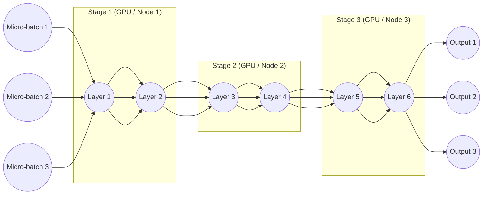
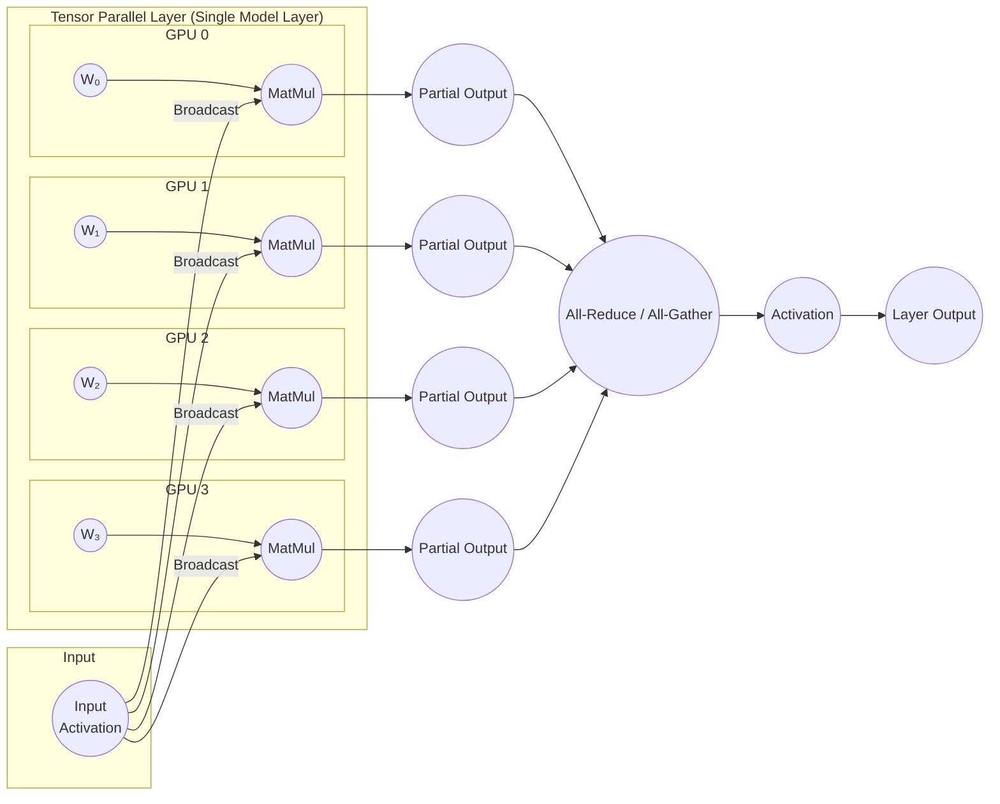

# Model Parallelism

When models grow too large to fit into the memory of a single GPU, we must move beyond Data Parallelism and into **Model Parallelism (MP)**. In this strategy, we don't copy the model; we slice it into pieces and distribute those pieces across different chips.

In 2026, Model Parallelism is typically split into two distinct engineering techniques: **Pipeline Parallelism** and **Tensor Parallelism**.

---
## 1. Pipeline Parallelism (Layer-wise Splitting)
In 2026, Pipeline Parallelism (PP) is the primary method used to overcome the **"Memory Wall"** for deep models that are too tall (too many layers) to fit on a single GPU. 
It is essentially a strategy of spatial distribution—spreading the depth of the model across multiple hardware nodes.

* **The Workflow:** Data enters GPU A, goes through the first 40 layers, and the resulting "activations" (intermediate results) are sent over the network to GPU B to finish the job.

  - **The Assembly Line Concept** If you think of a neural network as an assembly line, each GPU acts as a workstation.
    - **GPU 0** handles the first 20 layers (the "stem").
    - **GPU 1** handles the next 20 layers (the "body").
    - **GPU 2** handles the final 20 layers (the "head").

  - **Data Flow** This creates a logical "pipeline."
    - Forward pass:
      - The `entire dataset` gets handled by **GPU 0**.
      - The `activations` data flow linearly from GPU 0 to GPU 1, and eventually to GPU 2.
      - The `labels` data get passed from GPU 0 directly to GPU 2, so predictions can be made.
    - Backward pass:
      - The 'gradients' flows from GPU 2 to GPU 1, and eventually GPU 0. 

* **The Challenge / Problem (The "Pipeline Bubble"):**
  - The biggest weakness of a simple pipeline is underutilization. In a naive implementation:
    - **GPU 0** processes a batch and passes it to GPU 1.
    - **GPU 0 now sits idle** (doing nothing) while GPU 1 works.
    - Once GPU 1 finishes, it passes data to GPU 2.
    - **GPU 0 and GPU 1 both sit idle** while GPU 2 works.
  - This idle time is called the **"Bubble."** In large clusters, this bubble can waste 50-70% of your expensive compute power. 

* **The 2026 Solution (Micro-batching):**
  - To eliminate the bubble, we use **Micro-batching** (pioneered by GPipe and PipeDream). We break the large training batch into many tiny "micro-batches" (e.g., instead of 1 batch of 128, we use 16 micro-batches of 8).
  - **How it works:** As soon as GPU 0 finishes the first micro-batch and passes it to GPU 1, it doesn't wait. It immediately starts working on the second micro-batch.
  - **The Result:** The pipeline "fills up." Eventually, every GPU in the chain is working on a different micro-batch simultaneously. The "bubble" is reduced to only the very beginning and very end of the training step.

### Key Varieties of Pipeline Parallelism

#### A. GPipe (Synchronous)
All micro-batches go through the forward pass, then all go through the backward pass. It is very stable but requires storing many "activations" in memory while waiting for the backward pass to start.

#### B. PipeDream (Asynchronous / Interleaved)
GPUs don't wait for all micro-batches to finish. They interleave forward and backward tasks (1 Forward, 1 Backward). This is much more memory-efficient but mathematically more complex because different micro-batches might be using slightly different "versions" of the weights.

#### C. Interleaved Pipeline Schedule (1F1B)
This is the modern standard. It ensures that as soon as a GPU finishes the forward pass for a micro-batch, it performs a backward pass for an earlier one. This keeps memory usage "flat" and predictable.

### Challenges & Trade-offs

* **Latency:** Because data must travel across the network (InfiniBand/Ethernet) between GPUs, there is a "communication tax" every time you cross from one GPU to the next.

* **Complexity:** If the model has 100 layers and you have 4 GPUs, you have to decide exactly where to "cut" the model (e.g., 25-25-25-25) to ensure each GPU has the same amount of work. If one GPU has a "heavier" set of layers, it becomes a bottleneck.

---

## 2. Tensor Parallelism (Intra-layer Splitting)
This is a much "deeper" slice. Instead of splitting by layers, we split a **single mathematical operation** (like a massive Matrix Multiplication) across multiple GPUs.

* **The Workflow:** Imagine a layer that multiplies a 10,000x10,000 matrix. We split that matrix in half. **GPU A** calculates the top half of the result, and **GPU B** calculates the bottom half.

* **The Advantage:** This is the only way to handle individual layers that are too wide to fit in 192GB of VRAM (common in Ultra-LLMs).

* **The Requirement:** This requires ultra-fast, low-latency communication like **NVLink 5.0**, because the GPUs must "talk" to each other constantly during every single layer calculation, not just at the end.

**Deeper Dive**

In 2026, **Tensor Parallelism (TP)** is the most granular form of model parallelism. While Pipeline Parallelism splits a model between layers, Tensor Parallelism splits the **individual layers themselves**. 

It is specifically designed for "wide" models (models with massive hidden dimensions) where a single weight matrix is too large to fit into the memory of a single GPU.

### 1. How it Works: Matrix Sharding, and Key Varieties of Tensor Parallelism
At its core, a neural network layer is just a massive matrix multiplication: $Y = XA$. In Tensor Parallelism, we break the weight matrix $A$ into smaller "shards" and distribute them across multiple GPUs.

#### A. Column Parallelism
The weight matrix is **split vertically into columns**. 
* Each GPU gets a slice of the matrix. 
* Each GPU performs its own multiplication with the same input $X$.
* The results are then concatenated (joined) at the end.

#### B. Row Parallelism
The weight matrix is **split horizontally into rows.**
* The input $X$ is also split into columns to match.
* Each GPU performs a partial multiplication.
* The results are then summed together using an **All-Reduce** operation to get the final output.

### 2. The Communication Tax
Tensor Parallelism is powerful, but it comes with a **high "communication cost."** Unlike Pipeline Parallelism, which only communicates at the boundaries of large blocks of layers, Tensor Parallelism requires GPUs to sync up **after every single layer**.

* **The Barrier:** Because of this constant "talking," TP is **generally only feasible within a single server node** where GPUs are connected by ultra-high-speed links like **NVLink 5.0** or **AMD Infinity Fabric**. 
* **The Limit:** If you try to run Tensor Parallelism over standard Ethernet or even InfiniBand across different racks, the network latency will destroy your training speed.

### 3. Why it is Essential in 2026
Tensor Parallelism is the "secret sauce" behind training models with **massive hidden layers** (e.g., hidden dimensions of 12,288 or 16,384). 

1.  **Memory Management:** It allows a single 100GB layer to be split across four 80GB GPUs.

2.  **Compute Efficiency:** By splitting the math, multiple GPUs can calculate the "Attention" and "Feed-Forward" blocks of a Transformer simultaneously, significantly reducing the time for a single forward pass.

### 4. Tensor Parallelism in Transformers
In a standard Transformer block, Tensor Parallelism is typically applied to:

* **The Multi-Head Attention (MHA):** Different GPUs handle different "heads."

* **The Feed-Forward Network (FFN):** The massive linear layers are sharded.

---

## Comparison: Tensor vs. Pipeline Parallelism

| Feature | Tensor Parallelism (TP) | Pipeline Parallelism (PP) |
| :--- | :--- | :--- |
| **Granularity** | **Intra-layer** (Inside the layer) | **Inter-layer** (Between layers) |
| **Comm. Frequency** | Extremely High (Every layer) | Low (Every N layers) |
| **Network Requirement** | NVIDIA NVLink / AMD Infinity Fabric | InfiniBand / High-speed Network |
| **Best For** | Massive layer widths | Massive layer counts (depth) |
| **Complexity** | Very High (Requires custom kernels) | High (Requires scheduling) |

---

## 3. 3D Parallelism: The "Holy Grail"
For the largest models in 2026 (10T+ parameters), researchers use **3D Parallelism**, which combines all three techniques at once:
1.  **Data Parallelism:** To handle massive amounts of text.
2.  **Pipeline Parallelism:** To stack hundreds of layers across different server racks.
3.  **Tensor Parallelism:** To split individual wide layers across GPUs within a single rack.
