# ZeRO Algorithms: All-Reduce, Reduce Scatter, All-Gather


ZeRO Redundancy Optimization startegies use the following supporting algorithms:
* **Reduce-Scatter**
* **All-Gather**
* **All-Reduce**

---

## Algorithm Relationships

```mathematica
All Reduce = Reduce Scatter + All Gather
```

### Mental model

* **Reduce-Scatter**
  - Math plus partitioning

* **All-Gather**
  - Communication only

* **All-Reduce**
  - Everyone gets the same reduced result

### Terminologies Used

#### Rank 
A **rank** is a **unique numeric ID assigned to one participating worker** in a distributed job.

In **distributed training**, each process gets exactly **one rank**.

#### Rank vs GPU vs node
* **Rank** → communication identity
* **GPU** → compute device
* **Node** → physical machine

```
Node 0
  GPU 0 → Rank 0
  GPU 1 → Rank 1
  GPU 2 → Rank 2
  GPU 3 → Rank 3

Node 1
  GPU 0 → Rank 4
  GPU 1 → Rank 5
  GPU 2 → Rank 6
  GPU 3 → Rank 7
```

#### Shard
A **shard** is a contiguous slice of a larger tensor that has been partitioned across ranks so each worker owns only a fraction of the data.

Shard = 1 divided by number of ranks of a tensor

**Where shards appear in training systems**
| System	| What is sharded |
| :-- | :-- |
| DDP	| Nothing permanent |
| ZeRO-1	| Gradients and optimizer states |
| ZeRO-2	| Gradients, optimizer states, parameters during backward |
| ZeRO-3	| Everything |

#### Tensor

The **full tensor** is the whole book, and a **shard** is one chapter.

A **shard** is the piece of a **tensor** that a rank permanently keeps after distributed reduction, enabling large memory savings without changing the math.

---

## Reduce-Scatter: Reduce then Shard the Results
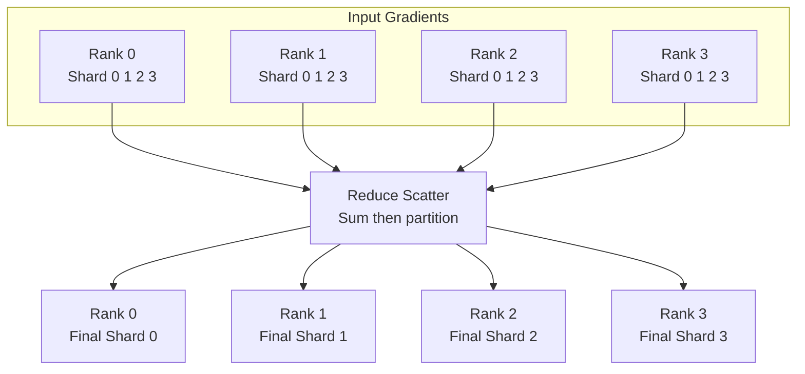

### Interpretation
* Each rank contributes a full tensor
* Reduction happens across ranks
* Output is **one reduced shard per rank**

---

## All-Gather: Shard to Full-Tensor
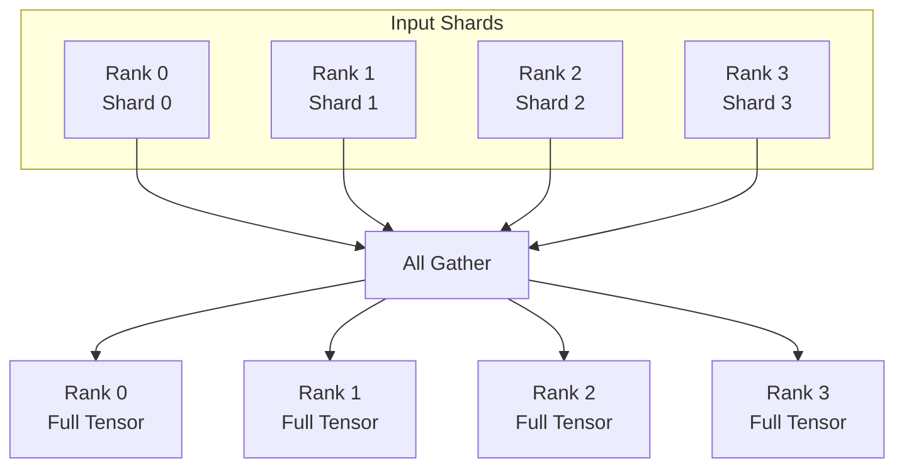

### Interpretation
* No math happens
* Pure communication
* Everyone reconstructs the full tensor

---

## All-Reduce via both: Reduce-Scatter plus All-Gather
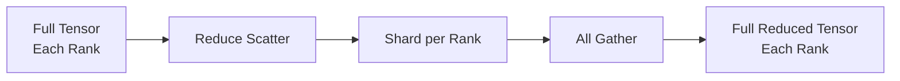

---

# Animated as a ring algorithm

## Ring Reduce-Scatter — step-by-step

Each step sends one shard clockwise, reduces on receipt, and discards what’s no longer needed.

### Step 1


### Step 2
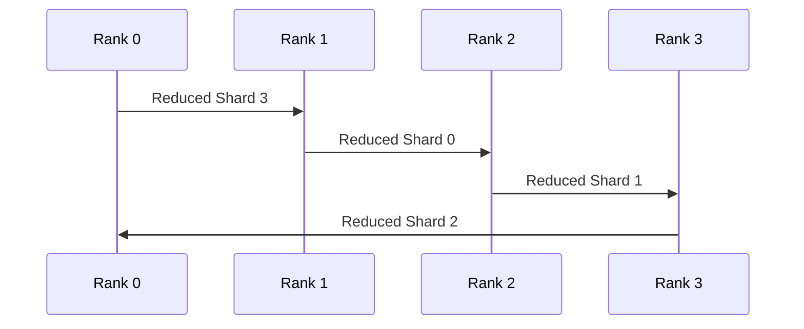

### Step 3: Final Reduce-Scatter state
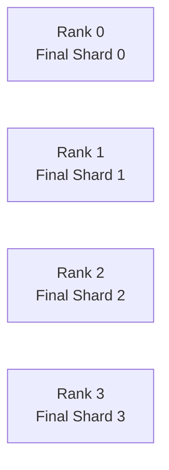
### Result
* Each rank owns one fully reduced shard
* No rank ever materializes the full tensor

## Ring All-Gather — rebuilding the full tensor
Now the shards circulate again, but no reduction, only forwarding.

### Step 1


### Step 2
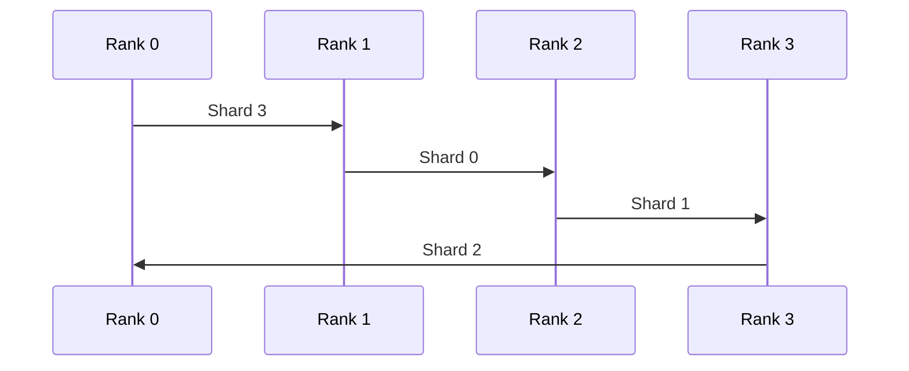

### Final State
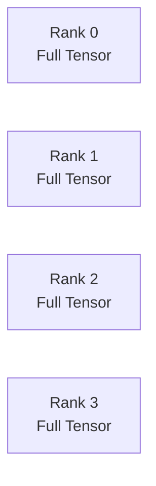

## Full ring All-Reduce summary

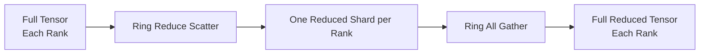

## Why the ring is powerful

* Bandwidth optimal
* Each link sends equal-sized chunks
* Total data per rank ≈ 2 times tensor size
* Scales linearly with number of ranks

---

# Unified Diagram with ZeRO-1/2/3 strategies

### Extended Reduce-Scatter context (pre-steps + backward)

**Canonical ZeRO-1 flow**

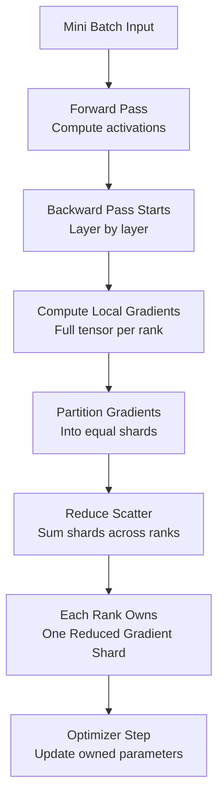

#### ZeRO-1 (only optimizer state is sharded)

**ZeRO 1**
Forward full → Backward full → Reduce scatter once

**Key point**
* Gradients exist in full briefly
* Reduce-scatter happens after gradient computation

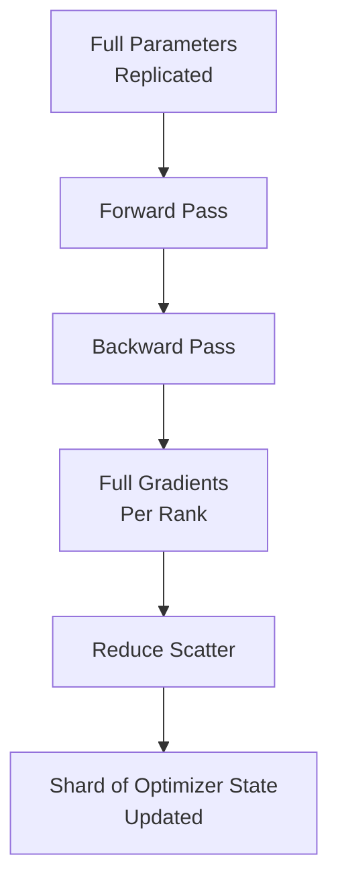

#### ZeRO-2 (gradients and optimizer state sharded)

**ZeRO 2**
Forward full → Backward layer → Reduce scatter per layer

**Key point**
* Reduce-scatter happens **layer by layer**
* Memory is freed earlier than ZeRO-1

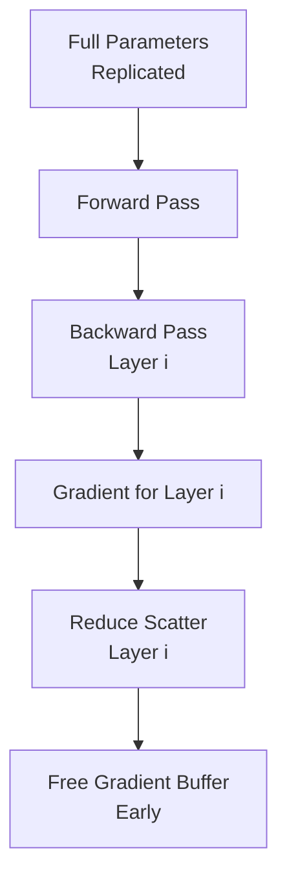

#### ZeRO-3 (everything sharded)

**ZeRO-3**
Gather params → Compute → Reduce scatter → Free

**Key point**
* Parameters are gathered **just in time**
* Reduce-scatter immediately follows gradient computation
* Maximum memory efficiency

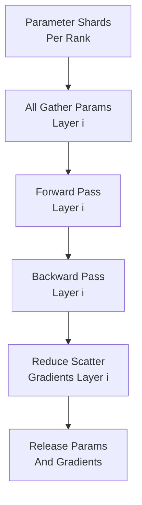

---
